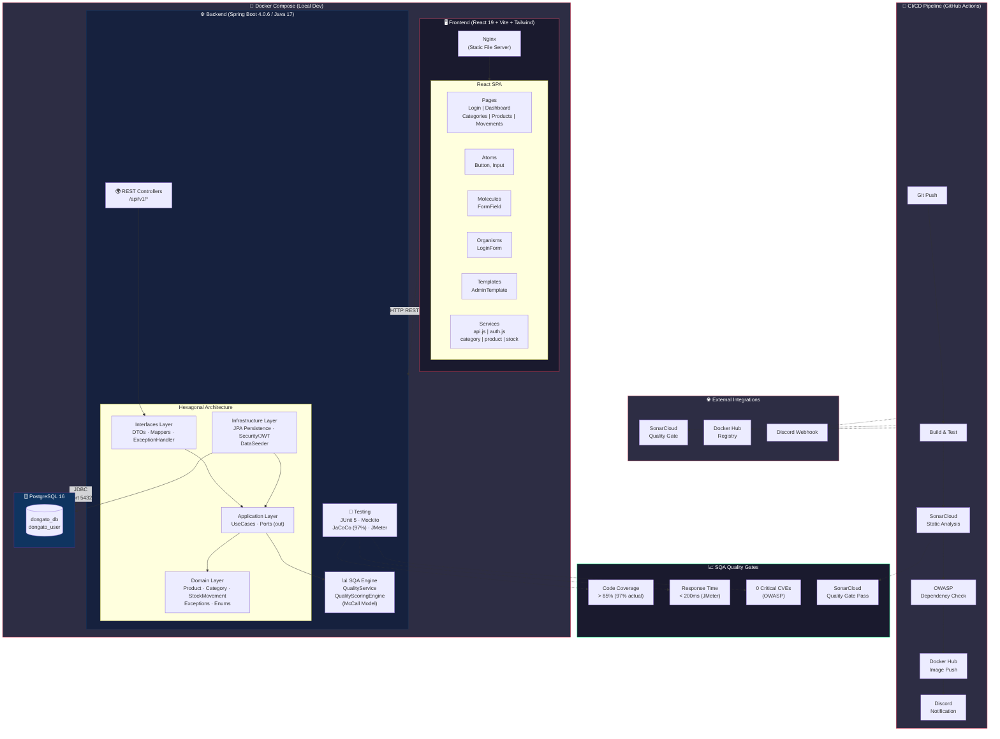

# Diagrama de Arquitectura - Don Gato Inventory SQA

```mermaid
graph TB
    subgraph CI_CD["🚀 CI/CD Pipeline (GitHub Actions)"]
        direction LR
        GH["Git Push"] --> BUILD["Build & Test"]
        BUILD --> SAST["SonarCloud<br/>Static Analysis"]
        SAST --> SCAN["OWASP<br/>Dependency Check"]
        SCAN --> DOCKER["Docker Hub<br/>Image Push"]
        DOCKER --> NOTIFY["Discord<br/>Notification"]
    end

    subgraph EXTERNAL["🌐 External Integrations"]
        SONAR["SonarCloud<br/>Quality Gate"]
        DHUB["Docker Hub<br/>Registry"]
        DC["Discord Webhook"]
    end

    subgraph FRONTEND["🖥️ Frontend (React 19 + Vite + Tailwind)"]
        direction TB
        NGINX["Nginx<br/>(Static File Server)"]
        subgraph UI["React SPA"]
            PAGES["Pages<br/>Login | Dashboard<br/>Categories | Products | Movements"]
            ATOMS["Atoms<br/>Button, Input"]
            MOLECULES["Molecules<br/>FormField"]
            ORGANISMS["Organisms<br/>LoginForm"]
            TEMPLATES["Templates<br/>AdminTemplate"]
            SERVICES["Services<br/>api.js | auth.js<br/>category | product | stock"]
        end
        NGINX --> UI
    end

    subgraph BACKEND["⚙️ Backend (Spring Boot 4.0.6 / Java 17)"]
        direction TB
        REST["🌍 REST Controllers<br/>/api/v1/*"]
        subgraph HEXAGONAL["Hexagonal Architecture"]
            INTERFACES["Interfaces Layer<br/>DTOs · Mappers · ExceptionHandler"]
            APP["Application Layer<br/>UseCases · Ports (out)"]
            DOMAIN["Domain Layer<br/>Product · Category · StockMovement<br/>Exceptions · Enums"]
            INFRA["Infrastructure Layer<br/>JPA Persistence · Security/JWT<br/>DataSeeder"]
        end
        SQA["📊 SQA Engine<br/>QualityService<br/>QualityScoringEngine<br/>(McCall Model)"]
        TEST["🧪 Testing<br/>JUnit 5 · Mockito<br/>JaCoCo (97%) · JMeter"]
    end

    subgraph DATABASE["🗄️ PostgreSQL 16"]
        DB[(dongato_db<br/>dongato_user)]
    end

    subgraph QA_METRICS["📈 SQA Quality Gates"]
        COVERAGE["Code Coverage<br/>> 85% (97% actual)"]
        PERF["Response Time<br/>< 200ms (JMeter)"]
        SECURITY["0 Critical CVEs<br/>(OWASP)"]
        SONARGATE["SonarCloud<br/>Quality Gate Pass"]
    end

    %% Frontend to Backend
    FRONTEND -->|"HTTP REST (JSON)"| BACKEND

    %% Backend to Database
    BACKEND -->|"JDBC<br/>Port 5432"| DATABASE

    %% Internal Backend Flow
    REST --> INTERFACES
    INTERFACES --> APP
    APP --> DOMAIN
    INFRA --> APP
    INFRA --> DATABASE
    APP --> SQA

    %% CI/CD Flow
    CI_CD -.-> SONAR
    CI_CD -.-> DHUB
    CI_CD -.-> DC

    %% QA Metrics
    TEST -.-> COVERAGE
    TEST -.-> PERF
    TEST -.-> SECURITY
    SAST -.-> SONARGATE

    %% Docker Compose (Local)
    subgraph DOCKER_COMPOSE["🐳 Docker Compose (Local Dev)"]
        FRONTEND
        BACKEND
        DATABASE
    end

    style FRONTEND fill:#1a1a2e,stroke:#e94560,color:#fff
    style BACKEND fill:#16213e,stroke:#0f3460,color:#fff
    style DATABASE fill:#0f3460,stroke:#533483,color:#fff
    style CI_CD fill:#2d2d44,stroke:#e94560,color:#fff
    style EXTERNAL fill:#2d2d44,stroke:#e94560,color:#fff
    style QA_METRICS fill:#1a1a2e,stroke:#00ff88,color:#fff
    style DOCKER_COMPOSE fill:#2d2d44,stroke:#e94560,color:#fff
```
